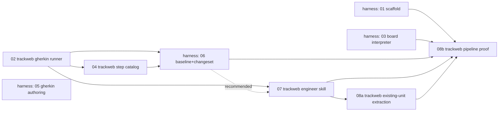

> # ⛔ ARCHIVED — this plan is dead and the backout is complete
>
> **As of 2026-08-18 the whole dungeon-harness plan is stopped**, including
> every track-web-scoped phase mirrored here. The removal landed in this repo
> as commit `8f9fe9c` (archived change
> `2026-08-18-dungeon-tactics-harness-backout`); nothing on the removal list
> remains. These files are kept as history only. It executed a Gherkin-authoring
> approach that put the LLM in the referee's chair for game rules and never
> produced a harness usable for design.
>
> - **Why, and the disposition of every piece:**
>   `harness/docs/dungeon-harness/STATUS.md` (sibling repo)
> - **Concrete removal plan for this repo:**
>   `harness/docs/dungeon-harness/backout-plan.md`
> - **Replacement, now partly built:** the harness rebuild at
>   `harness/docs/dungeon-harness/harness-rebuild/phase-plan.md` (the plan of
>   record). Its phases 1–4 shipped 2026-08-19 as a design bench that plays a
>   board through the real engine. In this repo that produced
>   `packages/dungeon-engine` and the engine **action surface** — see the
>   archived `dungeon-engine-action-surface` and `dungeon-game-action-adoption`
>   changes, and note the latter fixed a real aiming bug in the shipped game.
> - **Still not approved:** the rules layer,
>   `harness/docs/dungeon-harness/turn-machines/` (a declarative unit language).
>   Only a scoped slice is planned, as rebuild phase 5, and it has not started.
>
> **What this means for track-web specifically:** phase 02's Gherkin runner
> **stays** (frozen, as regression coverage — cucumber is not being removed
> yet) and 08a's `melee`/`rogue` `.feature` files **stay**; phase 04's step
> catalog and phase 07's `scenario-to-change` skill are **deleted**, and
> 08a's `melee-archetype`/`rogue-archetype` capability split is **unwound**
> back into `pc-archetypes`. Do not start new work from this plan.

# Dungeon-Harness Phases — track-web Side

track-web's copy of the **track-web-scoped** phases from the
`dungeon-harness` implementation plan. That plan lives in the separate,
sibling `harness` repo (see `harness/CLAUDE.md` for why it's a separate
project) at `harness/docs/dungeon-harness/proposal.md` +
`harness/docs/dungeon-harness/phases/`. This folder mirrors the 4 of its 8
phases that are actually track-web work (`Repo: track-web` in the source
plan); the other 4 (harness scaffold/board/authoring/baseline phases) stay
in the harness repo since they touch no track-web code.

**Read `proposal.md` in the harness repo first** for the full design this
plan executes — the delta/canonical split, the read-only boundary, the
baseline/changeset mechanism, and why round one is scoped to today's
existing units. These phase docs assume that context and only carry
decisions/steps, not the reasoning behind them (the proposal has that).

## Why these phases live here too

The designer/engineer split at the center of this design (see the
proposal's "Roles and the canonical artifact" section) puts the *engineer* —
working in track-web, not the harness — on the receiving end of phases 02,
04, 07, and 08. Keeping a copy where the engineer actually works means the
work items, deliverables, and OpenSpec capability names are visible without
context-switching into the other repo's checkout.

**This is a copy, not the source of truth.** If the harness repo's plan
changes, re-sync these files by hand; don't let them drift silently. The
harness repo's `harness/docs/dungeon-harness/phases/README.md` is the
canonical index of all 8 phases and their full dependency graph.

## Phases (track-web-scoped)

Phase 08 was split into 08a/08b: writing `.feature` files for the 4
existing units is agent extraction work (prose spec + implementation →
Gherkin, no undecided behavior), not a harness design session — see 08a's
"Why this isn't a harness design session" section.

| # | Phase | Status | Disposition |
|---|---|---|---|
| 02 | [Gherkin test runner](phase-02-trackweb-gherkin-runner.md) | ✅ Complete | **Keep, frozen** — regression coverage only |
| 04 | [Step catalog generator](phase-04-trackweb-step-catalog.md) | ✅ Complete | **Delete** — only fed harness drafting |
| 07 | [Engineer skill: scenario → OpenSpec change](phase-07-trackweb-engineer-skill.md) | ✅ Complete | **Delete** — consumes a bundle no longer produced |
| 08a | [Existing-unit Gherkin extraction (agent-driven)](phase-08a-trackweb-existing-unit-extraction.md) | ⚠️ Partial — `melee`, `rogue` only | **Keep features**, unwind the capability split |
| 08b | [Pipeline proof (real harness session)](phase-08b-trackweb-pipeline-proof.md) | ❌ Never started | Moot |

The phases numbered 01, 03, 05, 06 in the full plan are **harness-repo**
work (scaffold, board interpreter, Gherkin authoring core, baseline &
changeset) and are not duplicated here — see the harness repo's phases
folder if you need their detail. Phase 06 in particular is the first point
the two repos converge (it reads track-web's `features/` tree and
`steps-catalog.json` produced by phases 02 and 04), so it's worth reading
even though it isn't track-web work itself.

## Ordering, from track-web's side (historical)

The dependency graph as planned. Retained to explain how the built pieces
relate; not a plan to follow.

02 has no dependency on anything else and can start immediately, in
parallel with the harness's own scaffold phase (01). 04 only needs 02. 07's
dependency on 06 (harness-side) is soft — see phase 07's own note. 08a only
needs 02 and 07 — no harness session, so no dependency on harness's
01/03/05/06 at all. 08b genuinely needs the whole pipeline, both repos,
plus 08a's real baseline to exist first.

## Suggested OpenSpec capability names (historical)

What the plan intended. Note 08a diverged (see its own doc), creating the
`melee-archetype`/`rogue-archetype` split that the backout unwinds.

Carried over from the source phase docs, for quick reference:

- Phase 02: `dungeon-tactics-gherkin-runner`
- Phase 04: `dungeon-tactics-step-catalog` (resolved — its own capability,
  not folded into phase 02's change)
- Phase 07: not a spec'd runtime capability (it's a skill) — could still get
  its own small change describing expected behavior, for consistency
- Phase 08a: `MODIFIED Requirements` against the existing `pc-archetypes`
  capability's per-unit Requirements (confirmed via `scenario-to-change`'s
  own capability-matching step) — up to 4 separate changes, one per unit
- Phase 08b: same target capability as whichever unit(s) 08b picks, via a
  real harness handoff this time
