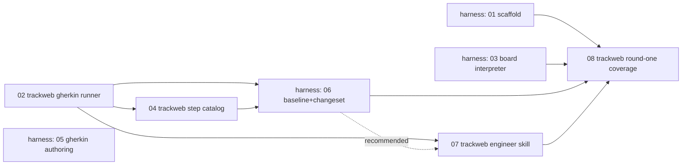

# Dungeon-Harness Phases — track-web Side

track-web's copy of the **track-web-scoped** phases from the
`dungeon-harness` implementation plan. That plan lives in the separate,
sibling `harness` repo (see `harness/CLAUDE.md` for why it's a separate
project) at `harness/docs/dungeon-harness/proposal.md` +
`harness/docs/dungeon-harness/phases/`. This folder mirrors the 4 of its 8
phases that are actually track-web work (`Repo: track-web` in the source
plan); the other 4 (harness scaffold/board/authoring/baseline phases) stay
in the harness repo since they touch no track-web code.

**Read `proposal.md` in the harness repo first** for the full design this
plan executes — the delta/canonical split, the read-only boundary, the
baseline/changeset mechanism, and why round one is scoped to today's
existing units. These phase docs assume that context and only carry
decisions/steps, not the reasoning behind them (the proposal has that).

## Why these phases live here too

The designer/engineer split at the center of this design (see the
proposal's "Roles and the canonical artifact" section) puts the *engineer* —
working in track-web, not the harness — on the receiving end of phases 02,
04, 07, and 08. Keeping a copy where the engineer actually works means the
work items, deliverables, and OpenSpec capability names are visible without
context-switching into the other repo's checkout.

**This is a copy, not the source of truth.** If the harness repo's plan
changes, re-sync these files by hand; don't let them drift silently. The
harness repo's `harness/docs/dungeon-harness/phases/README.md` is the
canonical index of all 8 phases and their full dependency graph.

## Phases (track-web-scoped)

| # | Phase | Depends on | Blocks |
|---|---|---|---|
| 02 | [Gherkin test runner](phase-02-trackweb-gherkin-runner.md) | — (parallel with harness phase 01) | 04, harness 06, 07, 08 |
| 04 | [Step catalog generator](phase-04-trackweb-step-catalog.md) | 02 | harness 06, 08 |
| 07 | [Engineer skill: scenario → OpenSpec change](phase-07-trackweb-engineer-skill.md) | 02 (hard); harness 06 (recommended) | 08 |
| 08 | [Round-one Gherkin coverage (existing units)](phase-08-trackweb-round-one-coverage.md) | all of harness 01–07 (see full graph in harness repo) | — (payoff phase) |

The phases numbered 01, 03, 05, 06 in the full plan are **harness-repo**
work (scaffold, board interpreter, Gherkin authoring core, baseline &
changeset) and are not duplicated here — see the harness repo's phases
folder if you need their detail. Phase 06 in particular is the first point
the two repos converge (it reads track-web's `features/` tree and
`steps-catalog.json` produced by phases 02 and 04), so it's worth reading
even though it isn't track-web work itself.

## Ordering, from track-web's side

02 has no dependency on anything else and can start immediately, in
parallel with the harness's own scaffold phase (01). 04 only needs 02. 07's
dependency on 06 (harness-side) is soft — see phase 07's own note — but 08
genuinely needs the whole pipeline, both repos, to exist first.

## Suggested OpenSpec capability names

Carried over from the source phase docs, for quick reference:

- Phase 02: `dungeon-tactics-gherkin-runner`
- Phase 04: fold into phase 02's change as an added requirement, or its own
  `dungeon-tactics-step-catalog` capability — decide at scoping time
- Phase 07: not a spec'd runtime capability (it's a skill) — could still get
  its own small change describing expected behavior, for consistency
- Phase 08: expect roughly 2–4 separate changes (one per unit or small
  batch), named per whatever capability convention the existing
  `dungeon-tactics` OpenSpec specs already use — not fixed in advance here
